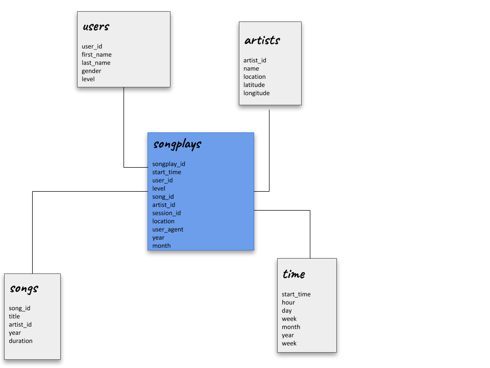

# Sparkify
### Data Lake

This project aims to prepare a data lake to storage the data of Sparkify. 

The importance of this is create a data lake where we can provide the information about Sparkify using a Amazon S3 to disponibilize the data, so others applications can access this information and make analysis about it.

## Database structure
The image below represents the schema choosen to our database:


In this project we are woorking with a star schema which consists in a fact table referencing multiples dimensions tables. It is a simple schema focused in make fast aggregations and guarantee easiers queries.

The name of our fact table is songplays and there we are going to keep the data about the song played on Sparkify. It is the main information about the startup and where we can make some analyzis to better understand the user and your preferences.

Besides that, the schema contains four more dimensions tables (users, songs, artists and time) where is the data that categorize the information we find in songplays table.
The information contained in each table is described here:

+ ***users***: users in the app
+ ***songs***: songs in music database
+ ***artists***: artists in music database
+ ***time***: timestamps of records in songplays broken down into specific units

Before insert the data into these tables, we copy the log files content to staging tables to make easier the process of Join when we need to insert a value in songplays table.

## How to execute the project
To run this project we execute the script that load all files and, from them, make some transformations and save the processed data in Amazon S3:

```
$ python etl.py
```

### etl.py functions
+ **create_spark_session**
It creates a Spark session to run the project

+ **process_song_data**
It loads the songs data and create a data frame with this. From this data frame we create two others data frames, the first has the songs informations and the second has the artists informations. From each one we create a directory with parquet files in S3.

+ **process_log_data**
It loads the logs from Sparkify and create a data frame with this data. After this we filter the data frame to get only the events of `NextSong` so we can use this filtered data frame to create a user and a time data frame. Also from this data frame we join with a dataframe from song data to create the songplays data frame. For each one of these data frames we create a directory in S3 with parquet files.

+ **main**
It creates a Spark session and define the input and output path. With this information defined, the main calls the two functions above to make the process.